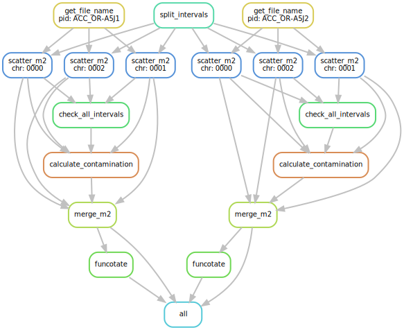

# smk-m2

Use snakemake to reproduce gatk-best-practice paired SNV calling [v2.6](https://github.com/gatk-workflows/gatk4-somatic-snvs-indels/tree/2.4.0). 

* If Terra's google bucket for legacy files are accessible, please use branch:`from_gs` which does not need additional localization step
* If not,  please use `from_signed_url` branch, where we will first localize bams using signed URL from NCI Data Commons. To do this, please generate a API key from https://nci-crdc.datacommons.io/ with your NIH account. Click on the "Profile" section in the upper right corner, then click "Create API key", in the window with your key click "Download json" to save your key to `credentials/credentials.json` .

There are configs that points to my local directories, please also change those accordingly.


## Directory structure

```
├── cluster.json
├── config.yaml
├── credentials
│   └── credentials.json # please do put your credential here!
├── dag.svg
├── README.md
├── res
│   ├── logs
│   │   ├── contam
│   │   │   ├── THCA_BJ-A2N8.log
│   │   │   └── THCA_BJ-A2N9.log
│   │   ├── funcotate
│   │   │   ├── THCA_BJ-A2N8.log
│   │   │   └── THCA_BJ-A2N9.log
│   │   ├── get_url
│   │   │   ├── THCA_BJ-A2N8.log
│   │   │   └── THCA_BJ-A2N9.log
│   │   ├── localize
│   │   │   ├── THCA_BJ-A2N8_normal.log
│   │   │   ├── THCA_BJ-A2N8_tumor.log
│   │   │   ├── THCA_BJ-A2N9_normal.log
│   │   │   └── THCA_BJ-A2N9_tumor.log
│   │   ├── merge_calls
│   │   │   ├── THCA_BJ-A2N8.log
│   │   │   └── THCA_BJ-A2N9.log
│   │   ├── scatter
│   │   │   ├── THCA_BJ-A2N8_0000.log
│   │   │   ├── THCA_BJ-A2N8_0001.log
│   │   │   ├── THCA_BJ-A2N8_0002.log
│   │   │   ├── THCA_BJ-A2N9_0000.log
│   │   │   ├── THCA_BJ-A2N9_0001.log
│   │   │   └── THCA_BJ-A2N9_0002.log
│   │   └── split_interval
│   │       └── log
│   ├── subintervals
│   │   ├── 0000-scattered.interval_list
│   │   ├── 0001-scattered.interval_list
│   │   └── 0002-scattered.interval_list`
│   └── THCA_BJ-A2N9 # only show one example
│       ├── annot_merged_filtered.vcf
│       ├── artifact_prior.tar.gz
│       ├── contamination.table
│       ├── f1r2
│       │   ├── 0000-f1r2.tar.gz
│       │   ├── 0001-f1r2.tar.gz
│       │   └── 0002-f1r2.tar.gz
│       ├── filtering.stats
│       ├── flag
│       ├── fs_flag
│       ├── funco_flag
│       ├── merged_filtered.vcf
│       ├── merged_filtered.vcf.idx
│       ├── merged_unfiltered.stats
│       ├── merged_unfiltered.vcf
│       ├── merged_unfiltered.vcf.idx
│       ├── normal.bai
│       ├── normal_name.txt
│       ├── normal_pile.tsv
│       ├── normal_url.txt
│       ├── npile_dir
│       │   ├── 0000-npile.table
│       │   ├── 0001-npile.table
│       │   └── 0002-npile.table
│       ├── segments.table
│       ├── subvcfs
│       │   ├── 0000.vcf
│       │   ├── 0000.vcf.idx
│       │   ├── 0000.vcf.stats
│       │   ├── 0001.vcf
│       │   ├── 0001.vcf.idx
│       │   ├── 0001.vcf.stats
│       │   ├── 0002.vcf
│       │   ├── 0002.vcf.idx
│       │   └── 0002.vcf.stats
│       ├── tpile_dir
│       │   ├── 0000-tpile.table
│       │   ├── 0001-tpile.table
│       │   └── 0002-tpile.table
│       ├── tumor.bai
│       ├── tumor_name.txt
│       ├── tumor_pile.tsv
│       └── tumor_url.txt
├── scripts
│   ├── common
│   │   └── __init__.py
│   └── localize_from_nci.py
├── Snakefile
└── test_samples.txt
```


## DAG



